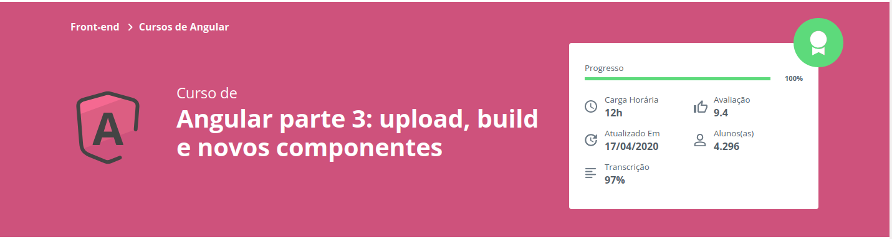

# Alurapic

This project was generated with [Angular CLI](https://github.com/angular/angular-cli) version 6.0.7.

# Instalação e Execução

Para instalar e executar o projeto em su a máquina, você pode ir na aba **Wiki** desde repositóio ou [clique aqui](https://github.com/senaluisgf/Angular-AluraPic/wiki)

## Conhecimentos Adquiridos
- **Angular parte 1: Fundamentos**
    -  Fundamentos do Angular
    -  Criação de componentes
    -  Comunicação entre componentes dentro da aplicação
    -  Utilização do Bootstrap 4 durante o desenvolvimento
    -  Organização de módulos e submódulos na aplicação
    - Integração com uma Web API
- **Angular parte 2: Autenticação, Forms e lazy loading**
    - Entendimento sobre como é o fluxo de autenticação de uma SPA
    - Automação do envio do token de autenticação
    - Projeção de rotas que requerem autenticação
    - Melhora de performance da aplicação através de lazy loading
    - Criação de validadores próprios para formulários
    - Implementação de validação assíncrona
- **Angular parte 3: upload, build e novos componentes**
    - Realização de uploads dentro do Angular
    - Lidar com segmentos de rotas
    - Permissões de usuários autenticados
    - Diferenciar variáveis de ambientes de deploy
- **Angular parte 4: lapidando o projeto**
    - Criação de componentes avançados
    - Adição indicação de uploado de fotos
    - Interceptação de erros e redirecionamento para server de erros
    - Validação de formulário de forma mais aprofundada
    - Dando continuidade a tarefas solicitadas depois de logar

## Cursos Implementados

[Angular parte 1: Fundamentos](https://cursos.alura.com.br/course/angular-fundamentos)
*(Clique [aqui](https://github.com/senaluisgf/Angular-AluraPic/releases/tag/angular_parte01) para baixar o código desenvolvido até esta etapa)*

[Angular parte 2: Autenticação, Forms e lazy loading](https://cursos.alura.com.br/course/angular-autenticacao)
*(Clique [aqui](https://github.com/senaluisgf/Angular-AluraPic/releases/tag/angular_parte02) para baixar o código desenvolvido até esta etapa)*

[Angular parte 3: upload, build e novos componentes](https://cursos.alura.com.br/course/angular-upload-build)
*(Clique [aqui](https://github.com/senaluisgf/Angular-AluraPic/releases/tag/angular_parte03) para baixar o código desenvolvido até esta etapa)*

[Angular parte 4: lapidando o projeto](https://cursos.alura.com.br/course/angular-lapidando-projeto)
*(Clique [aqui](https://github.com/senaluisgf/Angular-AluraPic/releases/tag/angular_parte04) para baixar o código desenvolvido até esta etapa)*

